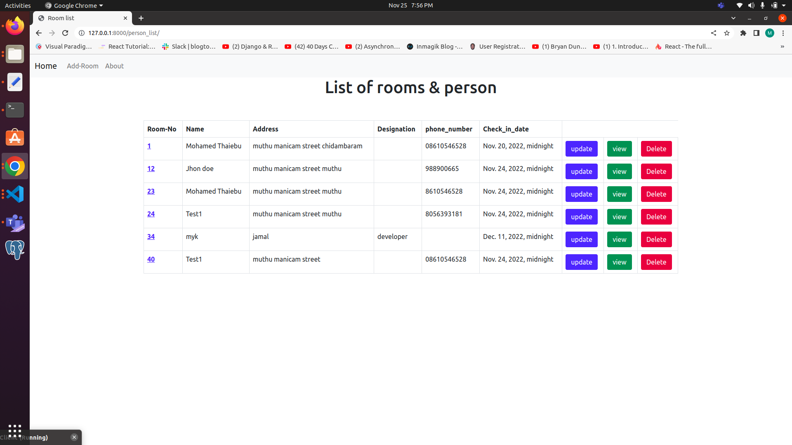

### How to Run This app 

- pip install -r requirements.txt 

- python manage.py runserver

### To Use Web - App

- Go to Home  http://127.0.0.1:8000/

# Get Room List
- http://127.0.0.1:8000/person_list/

- It's Look Like This You can Edit,Update,

